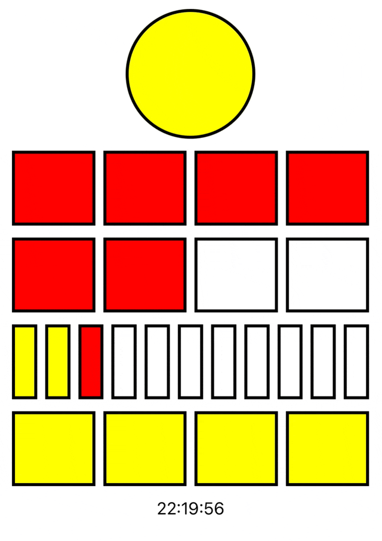

# Berlin Clock Test 2022-DEV2-029

The Berlin Clock (Mengenlehreclock or Berlin Uhr) is a clock that tells the time using a series of illuminated coloured blocks, as you can see in the picture for this project.

The top lamp blinks to show seconds- it is illuminated on even seconds and off on odd seconds.

The next two rows represent hours. The upper row represents 5 hour blocks and is made up of 4 red lamps. The lower row represents 1 hour blocks and is also made up of 4 red lamps.

The final two rows represent the minutes. The upper row represents 5 minute blocks, and is made up of 11 lamps- every third lamp is red, the rest are yellow. The bottom row represents 1 minute blocks, and is made up of 4 yellow lamps.

More information can be found here: https://agilekatas.co.uk/katas/BerlinClock-Kata

## Notes

- The app has been built with Xcode and is optimized on iPhone device in portrait mode display.
- No specific configuration needed to execute this project, simply download it, doucle-click on MyBerlinClockTest.xcodeproj file and run it directly in Xcode.
- The architecture used in this project is MVVM in order to separate display and business logics. It is also easier to create tests with this approach.
- TDD was used during the development, writing tests that fail before writing business code.

## Useful links

For more informations about this kata: https://agilekatas.co.uk/katas/BerlinClock-Kata
